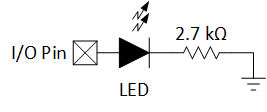
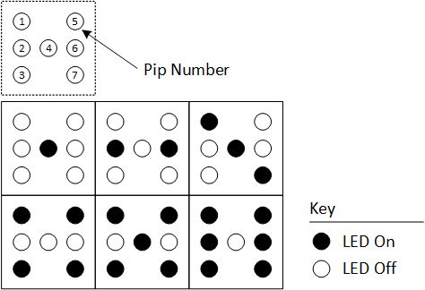
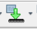
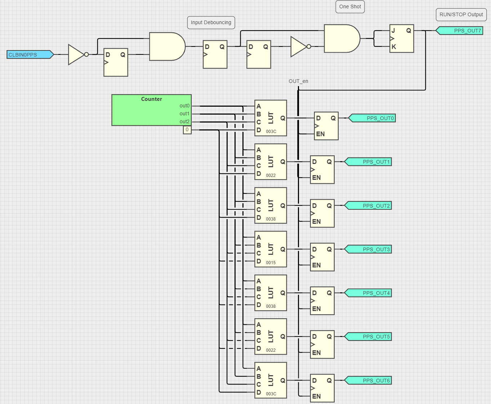
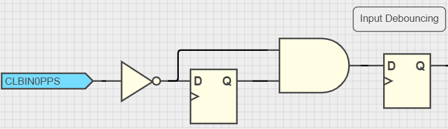
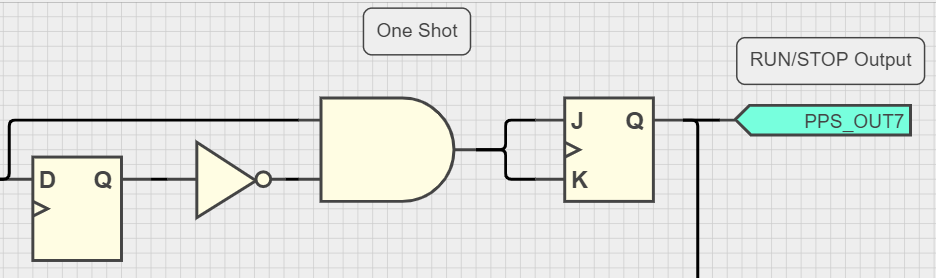
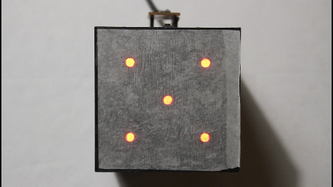
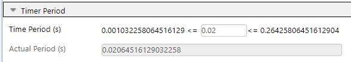

<!-- Please do not change this logo with link -->

[](https://www.microchip.com)

# Zero-Software eDice with the CLB on the PIC16F13145 

The Configurable Logic Block (CLB) inside the PIC16F13145 family of microcontrollers (MCUs) is an array of Look-Up Tables (LUTs) similar to that of a small Field Programmable Gate Array (FPGA). With the CLB, the software complexity associated with implementing an electronic die is significantly reduced. Since MPLAB&reg; Code Configurator (MCC) is used to generate the APIs and initialization code, there are zero changes required to the microcontroller's program.  

  

## Caution  

This example contains blinking lights. If you are sensitive to flashing/blinking lights, exercise caution when viewing or recreating. 

## Related Documentation

- [7-Segment Display Decoder Example](https://mplab-discover.microchip.com/com.microchip.mcu8.mplabx.project.pic16f13145-7-segment-decoder-mplab-mcc)
- [PIC16F13145 Device Page](https://www.microchip.com/en-us/product/PIC16F13145?utm_source=GitHub&utm_medium=TextLink&utm_campaign=MCU8_MMTCha_PIC16F13145&utm_content=pic16f13145-clb-dice-mplab-mcc-github&utm_bu=MCU08)

## Software Used
- [MPLAB X IDE 6.15.0 or newer](https://www.microchip.com/en-us/tools-resources/develop/mplab-x-ide?utm_source=GitHub&utm_medium=TextLink&utm_campaign=MCU8_MMTCha_PIC16F13145&utm_content=pic16f13145-clb-dice-mplab-mcc-github&utm_bu=MCU08)
- [MPLAB XC8 2.46.0 or newer](https://www.microchip.com/en-us/tools-resources/develop/mplab-xc-compilers?utm_source=GitHub&utm_medium=TextLink&utm_campaign=MCU8_MMTCha_PIC16F13145&utm_content=pic16f13145-clb-dice-mplab-mcc-github&utm_bu=MCU08)
- [MPLAB Code Configurator (MCC)](https://www.microchip.com/en-us/tools-resources/configure/mplab-code-configurator?utm_source=GitHub&utm_medium=TextLink&utm_campaign=MCU8_MMTCha_PIC16F13145&utm_content=pic16f13145-clb-dice-mplab-mcc-github&utm_bu=MCU08)
- PIC16F1xxxx_DFP v1.24.387  

## Hardware Used

- [PIC16F13145 Curioisty Nano Evaluation Kit (EV06M52A)](https://www.microchip.com/en-us/development-tool/EV06M52A?utm_source=GitHub&utm_medium=TextLink&utm_campaign=MCU8_MMTCha_PIC16F13145&utm_content=pic16f13145-clb-dice-mplab-mcc-github&utm_bu=MCU08)
- 7 LEDs
- 7 Resistors for the LEDs (rec. 2.7 k&Omega;)  
      - Adjusting the resistor value will change the LED's brightness

## Setup

1. Build seven copies of the following circuit on a breadboard. For ease of wiring, the circuits can be placed in parallel, rather than building it like the dice dot (also known as a pip) pattern shown in step 2.

  

2. Connect each copy of the circuit with the appropriate pip, as shown in the figure and table below. 

  

| I/O Pin | Connection |
| ------- | -------- |
| RC6 | Pip 1
| RC7 | Pip 2
| RB7 | Pip 3
| RB5 | Pip 4
| RA2 | Pip 5
| RA1 | Pip 6
| RC0 | Pip 7
| GND | GND

3. Plug-in the Curiosity Nano.
4. Open MPLAB X IDE.
5. Open the project folder and press the Program button.  



### Full I/O Table

**Note**: This table contains all I/O used in the project, including I/O that is already connected on the Curiosity Nano.

| I/O Pin | Function |
| ------- | -------- |
| RC6 | Pip 1
| RC7 | Pip 2
| RB7 | Pip 3
| RB5 | Pip 4
| RA2 | Pip 5
| RA1 | Pip 6
| RC0 | Pip 7
| RC2 | LED0 (STOP/nRUN Status)
| RC3 | SW0 (START/STOP)
| RA3 | ~MCLR
| GND | GND

## Comparison to Software

The CLB significantly reduces the software overhead associated with implementing this example. In software, the CPU would have to get a periodic interrupt, increment a counter, perform counter logic, map the counter output to the I/O pins and then return to its previous task. With the CLB, all of the functions associated with this example are handled by the hardware, which leaves the CPU free to do other tasks without interruption. 

## Theory of Operation

The CLB is a series of LUTs, similiar to an FPGA. In the PIC16F13145 family of MCUs, there are 32 LUTs available. To configure the logic, use the CLB Synthesizer tool inside of MCC (or the equivalant [standalone online tool](https://logic.microchip.com/clbsynthesizer/)). Logic diagrams are screenshots of the tool. All of the configuration files (.clb and .v) are included in the example folders. 



There are three main function blocks in this program - an input handler, a free-running counter for number generation, and a series of LUTs for the display outputs. The CLB clock source is from TMR2.

### Input Handler

The input is composed of two sections - an input debouncer and a one-shot generator. When SW0 is pressed, a series of small "bounces" occur before the value stabilizes. To avoid instability due to this behavior, the CLB logic implements a small input debouncer out of two D-Flip Flops, an inverter, and an AND gate, as shown in the image below.

  

Then, a one-shot pulse generator is implemented to enable/disable the output Flip-Flops when the user presses a button. If the one-shot was removed, the dice would roll while the user held the button.

The one-shot works emits a pulse when the debouncer output in the previous clock cycle is not equal to current output of the debouncer, and the current signal is 1 (pressed). Then, the one-shot generates a pulse that causes the JK Flip-Flop to toggle on the next clock cycle. At this point, the one-shot output will become 0 as the previous and current values match. 

  

The state of the outputs is shown on LED0 on the Curiosity Nano. If the LED is ON, the output Flip-Flops maintain their state. When the LED is OFF, the output Flip-Flops can change value.

### Counter

The counter module is resposible for the "rolling" of the dice. On every edge of the CLB clock, it counts up until it reaches five. When the value five is reached, the next clock cycle will reset it to 0. This behavior is implemented in the Verilog module below. 

**Note**: The counter changes quickly, creating the illusion of randomness. 

```
module Counter(CLK, out0, out1, out2);
    reg[2:0] out;
    input CLK;
    output out0, out1, out2;

    assign out0 = out[0];
    assign out1 = out[1];
    assign out2 = out[2];

    always @(posedge CLK) 
    begin
      if (out >= 5)
        out <= 0;
      else 
         out <= out + 1;
    end

endmodule
```

### Output

To generate the outputs for the pips (LEDs), a LUT is used on each output. To determine the values in the LUT, go through the list of possible input values and determine for each pip if it should be ON (`1`) or OFF (`0`). Since the timer starts at 0, all outputs are offset by 1, which means that an input of 0 is a dice roll of 1.

A copy of the LUTs is shown below. 

  

| Input Value | PIP1 | PIP2 | PIP3 | PIP4 | PIP5 | PIP6 | PIP7
| ----------- | ---- | ---- | ---- | ---- | ---- | ---- | ----
| 000 | 0 | 0 | 0 | 1 | 0 | 0 | 0 
| 001 | 0 | 1 | 0 | 0 | 0 | 1 | 0 
| 010 | 1 | 0 | 0 | 1 | 0 | 0 | 1
| 011 | 1 | 0 | 1 | 0 | 1 | 0 | 1
| 100 | 1 | 0 | 1 | 1 | 1 | 0 | 1
| 101 | 1 | 1 | 1 | 0 | 1 | 1 | 1
| X   | 0 | 0 | 0 | 0 | 0 | 0 | 0

**Note**: X is any value not shown in the table.

Then, a D Flip-Flop with Enable is used to hold the value when the user is not rolling the dice. The enable signal comes from the output of the JK Flip-Flop in the Input block.

## Operation

  

To start "rolling" the dice, press and hold SW0 until the LEDs start blinking. This allows the LED outputs (Pips) to change state. In this mode, the LEDs will blink quickly as the timer value is constantly increasing. 

To stop "rolling" the dice, press and hold SW0 until the LEDs stop changing. This locks the outputs to the last value of the counter.

**Important**: The randomness of the dice roll comes from the user's response time. It is not a random number generator.

## Changing the roll rate

To change the rate the dice rolls at, adjust the period of TMR2 in MCC, press the generate button on the top left window, and reprogram. The default period is 20 ms. 

  

Faster periods will be more harder to predict, while slower periods are easier. The response time for button presses will improve on faster periods and reduce on slower periods. 

## Summary

This example has shown how the CLB can operate independently of the CPU. After initialization of the peripherals, the CPU is fully idle and able to do any other task in the MCU.